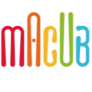

# macub-web-site

## Descripción del proyecto

Este proyecto corresponde al sitio web de "Macub". El objetivo principal es ofrecer una plataforma visual y funcional desarrollada íntegramente con HTML y CSS. La estructura del sitio permite una presentación clara de la información y una experiencia de usuario sencilla y eficiente.

### Tecnologías utilizadas

- **HTML:** Lenguaje de marcado utilizado para estructurar el contenido de la web.
- **CSS:** Hojas de estilo utilizadas para el diseño visual, incluyendo la gestión de alturas automáticas para que los elementos se adapten dinámicamente al contenido presentado.
